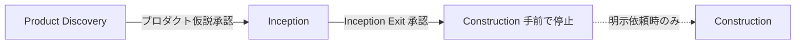

# 作業ログ 2026-06-07

**Intent**: `intent-001-household-finance-ai-agent`  
**プロジェクト**: 家計 AI エージェント MVP（4人家族・父向け Web アプリ）

---

## 概要

Product Discovery から AI-DLC Inception Exit までを完了し、Construction 手前で停止した。成果物は `main` ブランチにマージ済み。

---

## 1. Product Discovery

### 実施内容

- 仮 Intent を初期化（`intent-001-household-finance-ai-agent`）
- ユーザー回答に基づきプロダクト仮説・ユーザージャーニーを策定
- 見出し・ラベルを日本語化
- 成功指標 SM-1〜3 に定量的閾値を設定
- チェックリストによる自己確認
- プロダクト仮説を承認

### 確定した主要事項

| 項目 | 内容 |
|---|---|
| 対象ユーザー | 4人家族の**父**（主利用者） |
| 対応アプリ | Zaim、Moneytree（エクスポート取り込み） |
| プラットフォーム | Web（スマホブラウザ） |
| データ保存 | 端末内（ブラウザローカル）のみ |
| 必須機能 | 改善案 + 良かった点の評価（セット） |
| 成功指標 | SM-1: 5問中4問・30秒以内 / SM-2: 3カテゴリ±10% / SM-3: 10回中8回で改善案+良かった点 |

### 成果物

- `product-discovery/product-hypothesis.md`
- `product-discovery/user-journey.md`
- `reviews/product-discovery-review.md`

### Git

- PR #1（`quant-sm` → `main`）マージ済み

---

## 2. AI-DLC Inception

`/aidlc-inception-lite` に従い、全ステージを実施。各ステージで人間の承認を取得。

| # | ステージ | 承認 | 主な成果物 |
|---|---|---|---|
| 1 | intent-bootstrap | ✅ | `workflow.md`, `open-questions.md`, `traceability.md`, `inception/` |
| 2 | workflow-composition | ✅ | `workflow-rationale.md` |
| 3 | requirements-analysis | ✅ | `inception/requirements.md`（FR-1〜10, NFR-1〜5） |
| 4 | user-stories | ✅ | `inception/personas.md`, `inception/stories.md`（S-1〜8） |
| 5 | wireframes | ✅ | `inception/wireframes/`（SCR-1〜4, HTML 4件） |
| 6 | application-design | ✅ | `inception/application-design.md` |
| 7 | units-generation | ✅ | `inception/units-of-work.md`（単一ユニット U-1） |
| 8 | inception-exit | ✅ | `reviews/inception-exit-review.md` |

### 要件・設計の要点

- **画面**: ホーム、データ取り込み、AI チャット、設定（4画面）
- **ユニット**: U-1「家計 AI エージェント Web アプリ」（分割なし）
- **トレーサビリティ**: H → SM → FR/NFR → S → SCR → U-1 まで接続

---

## 3. 追加の決定事項（Inception 中）

| ID | 決定内容 |
|---|---|
| D-16 | エクスポート対応は **Zaim を最優先**（Moneytree は第2弾） |
| D-17 | AI 応答時は **Bプラン**（質問文 + 関連取引要約を外部 API に一時送信）。永続保存は端末内のみ |
| D-18 | Inception Exit 承認。Construction 手前で停止 |

---

## 4. 未解決の質問（残課題）

| ID | 内容 | 状態 |
|---|---|---|
| Q-1 | 対象外 E「その他」の具体内容 | Open |
| Q-2 | 期限・技術スタック・ビジネス制約 | Open |
| Q-3 | エクスポート形式の優先順位 | **回答済み** → D-16 |
| Q-4 | AI 外部 API へのデータ送信範囲 | **回答済み** → D-17 |

---

## 5. 最終状態

```text
Current Phase: stopped-before-construction
Status: completed
Product Hypothesis Approval: approved
Next Action: Construction 開始は人間の明示依頼が必要
```

Construction（コード生成・ライブラリ追加・インフラ構築）は**未実施**。

---

## 6. Git 履歴（本日関連）

| 操作 | 内容 |
|---|---|
| PR #1 | Product Discovery 成果物（`quant-sm` → `main`） |
| コミット `3f830aa` | Inception 成果物一式（`feat/inception-household-finance-ai-agent` → `main`） |

リポジトリ: `jpworksstudio-creator/ai-dlc-sample`  
ブランチ: `main`（`origin/main` と同期済み）

---

## 7. 成果物ディレクトリ構成

```text
docs/aidlc/intents/intent-001-household-finance-ai-agent/
├─ intent.md
├─ state.md
├─ workflow.md, workflow-rationale.md
├─ decisions.md（D-1〜D-18）
├─ open-questions.md
├─ traceability.md
├─ product-discovery/
│  ├─ product-hypothesis.md
│  └─ user-journey.md
├─ inception/
│  ├─ requirements.md
│  ├─ personas.md, stories.md
│  ├─ application-design.md
│  ├─ units-of-work.md
│  └─ wireframes/
│     ├─ screen-structure.md, screen-data-map.md, wireframe-guidance.md
│     └─ screens/（home, import, chat, settings）
└─ reviews/（全ステージ + inception-exit）
```

---

## 8. 本日の振り返り

### うまくいったこと

- **段階的な承認**で進めたことで、各フェーズのスコープが明確に保たれた
- Product Discovery で「誰の・何の課題か」を先に固めたおかげで、Inception 以降の FR/S/画面がブレにくかった
- SM-1〜3 を定量化したことで、MVP の「合格ライン」が後続の設計・検証に使える状態になった
- Q-3（Zaim 優先）・Q-4（Bプラン）を Inception Exit 前に回答し、実装前の重要な分岐を減らせた

### 学んだこと・気づき

- AI-DLC では **コードを書く前に**「仮説 → 指標 → 要件 → ストーリー → 画面 → 設計 → ユニット」までを文書でつなぐことが主作業
- **Facts / Hypotheses / Decisions / Open Questions** の分離が、何が確定で何が未検証かを常に見える化する
- **人間の承認ゲート**は手間だが、「Agent が勝手に次へ進む」ことを防ぎ、意図しないスコープ拡大を抑える
- ワイヤーフレーム（HTML）を挟むことで、アプリケーション設計の前に UI フローと状態（Empty/Error 等）を共有できる
- アプリケーション設計は **技術選定ではなく論理構造**（コンポーネント・サービス・データ）の段階である

### 改善できそうな点

- Q-1（対象外 E）、Q-2（技術・期限）は Construction 前に早めに埋めるとさらにスムーズ
- 承認のたびにチャットで依頼する運用は、チーム拡大時は `reviews/` のテンプレをさらに標準化するとよい

---

## 9. AI-DLC アプリケーション開発の理解（本日の実践から）

### 2つの大きなフェーズ



| フェーズ | 目的 | 本日の Skill | 止まる場所 |
|---|---|---|---|
| **Product Discovery** | 誰の・何の問題か、何を検証するか | `ux-product-discovery-lite` | プロダクト仮説承認 |
| **Inception** | 実装可能な計画成果物まで落とす | `aidlc-inception-lite` 配下 7 Skill | Inception Exit（Construction 前） |
| **Construction** | コード・インフラ | 本 Harness では未実施 | — |

### Inception 内部の流れ（本日実行順）

```text
intent-bootstrap
  → workflow-composition
  → requirements-analysis
  → user-stories
  → wireframes
  → application-design
  → units-generation
  → inception-exit
```

各矢印の間に **人間の承認** と **`reviews/*-review.md`** が入る。

### トレーサビリティの一本線

本日つないだ経路:

```text
H-1（カテゴリ補正の仮説）
  → SM-2（±10%）
  → FR-6 / NFR-3
  → S-4（カテゴリ別支出）
  → SCR-3（AI チャット）
  → U-1（Web アプリ）
```

「なぜこの画面・この機能があるか」を上流まで辿れるのが AI-DLC の核心。

### 3層の役割（リポジトリ構成）

| 層 | パス | 役割 |
|---|---|---|
| Skill（手順書） | `.agents/skills/` | Agent が何をいつどう進めるか |
| 入口ルール | `.cursor/rules/` | どの Skill から始めるか |
| 成果物・検証 | `docs/aidlc/` | 記録・テンプレ・チェックリスト・Intent 成果物 |

### Construction-ready の意味

本日の終了時点で揃っているもの:

- **何を作るか**（要件・ストーリー）
- **どう見せるか**（ワイヤーフレーム）
- **どう構成するか**（論理設計・ユニット）
- **いつ止めるか**（Inception Exit）

まだ揃っていないもの: フレームワーク選定、LLM プロバイダ、実装コード（意図的に保留）。

---

## 10. 重要プロンプトと成果物の対応

本日のセッションで実行した **主要なプロンプト（依頼）** と、それによって生成・更新された成果物。

### Product Discovery フェーズ

| # | プロンプト（要約） | 実行 Skill / ルール | 主な成果物・更新 |
|---|---|---|---|
| P-1 | `/ux-product-discovery-lite` を実行。仮 Intent 初期化し、確認質問を出す | `ux-product-discovery-lite` | `intent.md`, `state.md`, `product-discovery/product-hypothesis.md`, `product-discovery/user-journey.md` |
| P-2 | MVP 概要への回答（10項目：家計 AI、父、Zaim/Moneytree 等） | （Discovery 継続） | `product-hypothesis.md`, `user-journey.md` 更新。Slug → `household-finance-ai-agent` |
| P-3 | 追加回答（対象外 B,C,D,E / 父 / Zaim+Moneytree / 良かった点必須 / ローカル保存） | （Discovery 継続） | 同上 + Facts/Decisions 充実 |
| P-4 | 英語見出しを日本語にして | （編集） | 全 Discovery 成果物の日本語化 |
| P-5 | `product-discovery-checklist.md` で自己確認。承認直前で停止 | チェックリスト | （レビュー報告のみ。承認前） |
| P-6 | SM-1〜3 の定量的閾値を指定して更新 | （編集） | `product-hypothesis.md` 成功指標更新 |
| P-7 | プロダクト仮説を承認。`state.md`, `reviews/product-discovery-review.md`, `decisions.md` 更新 | 承認ゲート | `state.md`（completed）, `reviews/product-discovery-review.md`, `decisions.md`（D-1〜D-8） |

### Git・理解の深化

| # | プロンプト（要約） | 主な成果物・更新 |
|---|---|---|
| P-8 | `.agents` / `.cursor` / `docs` の理解を説明して | （説明のみ。成果物なし） |
| P-9 | main ブランチにプッシュ | PR #1 マージ済みと確認（Discovery 時点の成果物） |

### Inception フェーズ

| # | プロンプト（要約） | 実行 Skill | 主な成果物・更新 |
|---|---|---|---|
| P-10 | `/aidlc-inception-lite` 開始。各工程で承認を求め、Construction 前で停止 | `aidlc-inception-lite` | 以下 P-11〜P-18 の親プロンプト |
| P-11 | （Agent 自動）intent-bootstrap 実施 → **「intent-bootstrap を承認」** | `aidlc-intent-bootstrap-lite` | `workflow.md`, `open-questions.md`, `traceability.md`, `inception/`, `reviews/intent-bootstrap-review.md`, `decisions.md` D-9 |
| P-12 | **「workflow を承認」** | `aidlc-workflow-composition-lite` | `workflow-rationale.md`, `reviews/workflow-review.md`, `decisions.md` D-10 |
| P-13 | **「requirements を承認」** | `aidlc-requirements-analysis-lite` | `inception/requirements.md`, `reviews/requirements-review.md`, `traceability.md`, `decisions.md` D-11 |
| P-14 | **「user-stories を承認」** | `aidlc-user-stories-lite` | `inception/personas.md`, `inception/stories.md`, `reviews/user-stories-review.md`, `decisions.md` D-12 |
| P-15 | **「wireframes を承認」** | `aidlc-wireframes-lite` | `inception/wireframes/*`, `reviews/wireframes-review.md`, `decisions.md` D-13 |
| P-16 | **「application-design を承認」** | `aidlc-application-design-lite` | `inception/application-design.md`, `reviews/application-design-review.md`, `decisions.md` D-14 |
| P-17 | **「units を承認」** | `aidlc-units-generation-lite` | `inception/units-of-work.md`, `reviews/units-review.md`, `reviews/inception-exit-review.md`（草案）, `decisions.md` D-15 |
| P-18 | Q-3 Zaim 優先 / Q-4 Bプラン と回答 | （Open Questions 解消） | `open-questions.md`, `decisions.md` D-16, D-17, `requirements.md`, `application-design.md` 更新 |
| P-19 | **「inception exit を承認」** | Inception Exit チェックリスト | `reviews/inception-exit-review.md`, `state.md`（stopped-before-construction）, `workflow.md`, `decisions.md` D-18 |

### 仕上げ

| # | プロンプト（要約） | 主な成果物・更新 |
|---|---|---|
| P-20 | main ブランチにマージ | コミット `3f830aa`（Inception 成果物 26 ファイル）→ `origin/main` |
| P-21 | 本日の作業ログを md で作成 | `WORK-LOG-2026-06-07.md`（本ファイル） |
| P-22 | 振り返り・重要プロンプト対応を追記 | 本ファイル §8〜§10 |

### 承認プロンプトのパターン（覚えておくとよい）

Inception では、おおむね次の短い承認で次ステージに進んだ:

```text
intent-bootstrap を承認
workflow を承認
requirements を承認
user-stories を承認
wireframes を承認
application-design を承認
units を承認
inception exit を承認
```

各承認のたびに Agent は `reviews/*-review.md` の **状態** を「承認済み」にし、`state.md` の **Current Step** を進めた。

---

## 11. 次にできること

1. **Q-1, Q-2** を回答して `open-questions.md` を更新
2. **Construction** を明示依頼して実装フェーズへ（本 Harness の対象外）
3. **Moneytree 対応**（第2弾）を別 Intent またはスコープ拡張で計画
4. 本ログを読み返し、次の Intent では **P-1 → P-7 → P-10 → 承認連鎖** の流れをテンプレ化する
