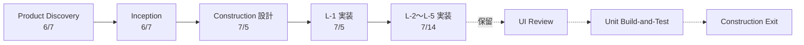

# 作業ログ 2026-07-14

**Intent**: `intent-001-household-finance-ai-agent`  
**プロジェクト**: 家計 AI エージェント MVP（4人家族・父向け Web アプリ）

---

## 概要

7/5 時点で止まっていた Code Generation L-1 承認待ちから再開し、**L-2〜L-5 まで実装・承認を完了**した。第1弾スコープ（Zaim + AI 相談 + 設定）のコードが `web/` に揃い、[PR #3](https://github.com/jpworksstudio-creator/ai-dlc-sample/pull/3) を `main` へマージ済み。UI Review / Unit Build-and-Test はユーザー指示により**未着手で保留**。

---

## 1. L-1 承認と L-2 着手

### 実施内容

- **「L-1 を承認」** → D-31、`layers/L-1/*` を Approved に更新
- 続けて L-2（localStorage・ドメインモデル・DatasetSummary）を実装
- ホームを `getDatasetSummary` 連携に更新（Empty / 取り込み済み）
- Vitest を導入し、アダプターのユニットテストを追加

### L-2 主なファイル

| Path | 内容 |
|---|---|
| `web/lib/types.ts` | HouseholdDataset, Transaction, DatasetSummary |
| `web/lib/storage/keys.ts` | `hfai:dataset`, `hfai:transactions` |
| `web/lib/storage/local-storage-adapter.ts` | CRUD + Quota Guard |
| `web/lib/services/dataset-summary.ts` | Empty 判定・件数 |
| `web/components/HomeDatasetSummary.tsx` | ホーム状態 UI（計画外 +1。8ファイル以内） |
| `web/vitest.config.ts` | Vitest + jsdom |

### 検証

| Check | Result |
|---|---|
| `npm test` | Pass（4件） |
| `npm run build` | Pass |

### 決定

| ID | 内容 |
|---|---|
| D-31 | L-1 承認（2026-07-08） |
| D-32 | L-2 承認（2026-07-14） |

---

## 2. Code Generation L-3（Zaim 取り込み）

### 実施内容

- **「L-2 を承認」** → L-3 実装
- Zaim CSV パーサー、カテゴリ正規化、SCR-2 取り込み画面
- Moneytree は disabled（BR-11 / D-23）
- `papaparse` を依存追加

### 主なファイル

| Path | 内容 |
|---|---|
| `web/lib/import/category-normalizer.ts` | 食費 / 日用品 / 固定費 / その他 |
| `web/lib/import/zaim-parser.ts` | 必須列検証・収入行スキップ・5MB 上限 |
| `web/app/import/page.tsx` | SCR-2 |
| `web/components/ImportForm.tsx` | ファイル選択・結果表示・Quota エラー |
| `web/fixtures/zaim-sample.csv` | テスト用サンプル |

### 検証

| Check | Result |
|---|---|
| `npm test` | Pass（累計 8件） |
| `npm run build` | Pass（`/import` 追加） |

### 決定

| ID | 内容 |
|---|---|
| D-33 | L-3 承認 |

---

## 3. Code Generation L-4（AI チャット）

### 実施内容

- **「L-3 を承認」** → L-4 実装
- `/api/chat`（空質問拒否・要約検証・mock / OpenAI）
- 取引要約（Bプラン）、構造化応答、SCR-3 チャット UI
- `.env.example` を生成（Secret なし）
- `openai@6.45.0` を依存追加

### 主なファイル

| Path | 内容 |
|---|---|
| `web/app/api/chat/route.ts` | Route Handler |
| `web/lib/ai/transaction-summarizer.ts` | 関連取引要約 |
| `web/lib/ai/structured-response.ts` | JSON 検証・モック応答 |
| `web/app/chat/page.tsx` / `ChatView.tsx` | SCR-3 |
| `web/.env.example` | `OPENAI_API_KEY` 等 |

### 検証

| Check | Result |
|---|---|
| `npm test` | Pass（累計 12件） |
| `npm run build` | Pass（`/chat`, `/api/chat`） |

### 開発時のメモ

- 実キーなし開発は `.env.local` に `OPENAI_API_KEY=mock`
- リポジトリ直下の `npm run dev` は失敗する（`package.json` は `web/` 配下）

### 決定

| ID | 内容 |
|---|---|
| D-34 | L-4 承認 |

---

## 4. Code Generation L-5（設定・全削除）

### 実施内容

- **「L-4 を承認」** → L-5 実装
- SCR-4 設定画面、削除確認ダイアログ（BR-10）、全データ削除
- **「L-5 を承認するがまだ次は実行しない」** → D-35 反映のみ。UI Review 等は保留

### 主なファイル

| Path | 内容 |
|---|---|
| `web/app/settings/page.tsx` | SCR-4 |
| `web/components/SettingsPanel.tsx` | 件数表示・削除ボタン |
| `web/components/DeleteConfirmDialog.tsx` | alertdialog |
| `web/lib/storage/delete-all.ts` | clearHouseholdData ラッパ |

### 検証

| Check | Result |
|---|---|
| `npm test` | Pass（累計 13件） |
| `npm run build` | Pass（`/settings` 追加） |

### 決定

| ID | 内容 |
|---|---|
| D-35 | L-5 承認。次ステージ（UI Review / Unit Build-and-Test）は保留 |

---

## 5. Layer 一覧（第1弾・本日完了）

| Layer | スコープ | 承認 |
|---|---|---|
| L-1 | Next.js 初期化、App Shell、ホーム Empty | D-31 ✅ |
| L-2 | localStorage、ドメインモデル、DatasetSummary | D-32 ✅ |
| L-3 | Zaim CSV 取り込み、カテゴリ正規化 | D-33 ✅ |
| L-4 | `/api/chat`、OpenAI、チャット UI | D-34 ✅ |
| L-5 | 設定・全削除 | D-35 ✅ |
| L-6 | Moneytree（後回し） | 対象外（D-23） |

---

## 6. Git / PR

| 操作 | 内容 |
|---|---|
| ブランチ | `feat/construction-l2-l5-mvp` |
| コミット | `95f07d9` — L-2〜L-5 実装 + D-31〜D-35 成果物 |
| PR | [#3](https://github.com/jpworksstudio-creator/ai-dlc-sample/pull/3) |
| マージ | `main` へ merge（`b2e8b08`）。ローカル `main` 同期済み |

リポジトリ: `jpworksstudio-creator/ai-dlc-sample`

---

## 7. 最終状態（本日終了時点）

```text
Current Phase: construction
Current Step: code-generation
Status: in-progress
Next Action: L-5 承認済み。UI Review / Unit Build-and-Test はユーザー指示待ち（未着手）
```

| 項目 | 状態 |
|---|---|
| Current Unit | U-1 |
| Layers L-1〜L-5 | すべて Approved |
| Vitest | 13 tests Pass |
| Build | `/`, `/import`, `/chat`, `/settings`, `/api/chat` |
| UI Review | 未着手（意図的保留） |
| Unit Build-and-Test | 未着手（意図的保留） |
| Construction Exit | 未実施 |

---

## 8. 本日増えた主な成果物

```text
docs/aidlc/intents/intent-001-household-finance-ai-agent/
├─ construction/U-1/
│  ├─ CODE_SUMMARY.md（L-1〜L-5）
│  └─ layers/
│     ├─ L-2/（diff-summary, build-and-test-report, review）
│     ├─ L-3/
│     ├─ L-4/
│     └─ L-5/
├─ decisions.md（D-31〜D-35）
├─ state.md / construction/state.md / traceability.md
└─ WORK-LOG-2026-07-14.md（本ファイル）

web/
├─ .env.example
├─ app/
│  ├─ api/chat/
│  ├─ chat/
│  ├─ import/
│  └─ settings/
├─ components/（HomeDatasetSummary, ImportForm, ChatView, SettingsPanel, DeleteConfirmDialog）
├─ fixtures/zaim-sample.csv
├─ lib/（types, storage, services, import, ai）
└─ vitest.config.ts
```

---

## 9. 本日の振り返り

### うまくいったこと

- **短い承認プロンプト**（`L-n を承認`）だけで、設計済みの Layer を1つずつコードに落とせた
- 7/5 で固めた Code Generation Plan（L-1〜L-5・5〜8ファイル）がそのまま実装のレールになり、スコープブレが少なかった
- L-2 で Vitest を入れたことで、以降の Layer も同じ `npm test` / `npm run build` で品質を説明できた
- L-5 承認時に「次は実行しない」と明示し、**実装完了と次レビュー開始を分離**してから PR マージできた
- PR #3 → `main` マージまで同日に完了し、第1弾アプリをリポジトリに定着できた

### 学んだこと・気づき

- Construction の本丸は「たくさん書く」ことではなく、**小さく書いて止め、承認してもらう**ことの繰り返しである
- 1回の承認プロンプトが引き起こす副作用が大きい:
  - `decisions.md` に Dn 追加
  - `layers/L-n/review.md` を Approved
  - `state.md` / `construction/state.md` / `CODE_SUMMARY.md` / `traceability.md` 更新
  - **次 Layer の実装まで自動で走る**（保留指示がない場合）
- Inception のワイヤーフレーム（Empty / Loading / Error / Success）が、そのまま ImportForm / ChatView / SettingsPanel の状態設計になった
- Bプラン（質問 + 取引要約のみ送信）は、L-4 で `transaction-summarizer` → `/api/chat` というコード構造に直結した
- アプリルートは `web/`。Harness 文書（`docs/aidlc/`）とコードを分けたおかげで、PR の差分も「文書」と「実装」が読み取りやすい

### 改善できそうな点

- 実 Zaim エクスポートでの一度の取り込み確認（列名差分の検知）がまだない
- ESLint 未設定（Lint Not Run）。Unit Build-and-Test 前に入れるとゲートが揃う
- UI Review を後ろ倒しにしたため、文言・フォーカス・a11y は実装直後の「正式レビュー」が未実施
- 中断（「続きを実行」）が発生したので、長い Layer 作業後は早めに成果物3点セットを確定させる運用がよい

### Construction で見えた「AI-DLC らしさ」

| 観点 | 本日の実感 |
|---|---|
| 人間の役割 | 「何を作るか」を決めるより、「ここまででよいか」を承認する |
| Agent の役割 | 承認後に次 Layer を実装し、報告して止まる |
| 文書の役割 | 手戻り防止と、レビュー・PR・学習の説明責任 |
| コードの役割 | 承認済み Plan の具体化（勝手な拡張は Review で説明が要る） |

---

## 10. AI-DLC アプリケーション開発の理解（7/14実践で深まった点）

### 全体像の中での本日の位置



本日は **「設計済みの計画を、Layer 単位でコードに落とす日」**だった。

### Code Generation + Build/Test の2 Skill 連携

| Skill | 役割 | 本日の成果物 |
|---|---|---|
| `aidlc-code-generation-lite` | Layer 実装・テスト追加・diff-summary / review | `web/*`, `layers/L-n/diff-summary.md`, `layers/L-n/review.md` |
| `aidlc-build-and-test-lite` | Lint/Test/Build の記録と承認ゲート | `layers/L-n/build-and-test-report.md` |

実装のたびに両方がセットで出てくる。片方だけだと「動いた／動いてない」の説明責任が弱い。

### Layer ループの実体

```text
前 Layer 承認
  → aidlc-code-generation-lite（5〜8 files + テスト）
  → aidlc-build-and-test-lite（npm test / build）
  → layers/L-n/{diff-summary, build-and-test-report, review}
  → 人間チェックポイントで停止
  → 「L-n を承認」（+ 必要なら保留・Git 指示）
```

このループを L-2〜L-5 で4回回し、第1弾アプリが完成した。

### 「承認」が持つ3つの意味

| 意味 | 具体例（本日） |
|---|---|
| **過去の確定** | `layers/L-3/review.md` Status: Approved、D-33 |
| **次の許可** | L-4 実装（`/api/chat`, ChatView）の着手権 |
| **記録の更新** | `traceability.md` に FR-1 → `zaim-parser.ts` を追記 |

短い「L-3 を承認」は、単なる OK ではなく **状態機械の遷移コマンド**である。

### 「承認しても次へ進まない」の使いどころ

- Harness の既定は「承認 → 次ステージ自動着手」
- 今日の `L-5 を承認するがまだ次は実行しないで` は、**遷移コマンドに制約を付ける**書き方
- 効果: D-35 と state 更新は行い、UI Review には入らない → その間に Git で固める

### トレーサビリティの「文書→コード」接続

本日つないだ経路の例:

```text
H-1（カテゴリ補正）
  → SM-2 / NFR-3
  → BR-7
  → L-3 category-normalizer.ts
  →（将来）L-4 が食費金額を回答

FR-1 / S-1 / SCR-2
  → L-3 zaim-parser.ts + ImportForm.tsx

FR-4〜9 / S-3〜S-7 / SCR-3
  → L-4 ChatView.tsx + /api/chat

FR-10 / S-8 / SCR-4
  → L-5 SettingsPanel.tsx + delete-all.ts
```

Inception の一本線が、今日初めて **具体的なソースパス**に着地した。

### 3層モデルの再確認（実装日に効いたこと）

| 層 | パス | 本日の効き方 |
|---|---|---|
| Skill | `.agents/skills/aidlc-code-generation-lite` 等 | ファイル数制限・停止条件・成果物パスを規定 |
| 入口 | `.cursor/rules/aidlc-entry.mdc` | Construction 継続時の導線 |
| 成果物 | `docs/aidlc/...` + `web/` | 承認記録は docs、動くアプリは web |

「Agent が勝手に全部実装しきらない」のは、Skill の Stop Conditions と人間ゲートの合わさりである。

---

## 11. 重要プロンプトと成果物の対応（7/14）

本日のセッションで実行した **主要なプロンプト（依頼）** と、それによって生成・更新された成果物。

### Code Generation ループ（メイン）

| # | プロンプト（要約） | 実行 Skill | 主な成果物・更新 |
|---|---|---|---|
| P-1 | **「L-1 を承認」** | code-generation + build-and-test ゲート | `layers/L-1/review.md` / `build-and-test-report.md` Approved、`decisions.md` **D-31**、`state.md` 更新 → **L-2 実装**: `web/lib/types.ts`, `storage/*`, `services/dataset-summary.ts`, `HomeDatasetSummary.tsx`, `vitest.config.ts`, テスト、`layers/L-2/*`（承認待ち） |
| P-2 | **「L-2 を承認」** | 同上 | **D-32**、L-2 Approved → **L-3 実装**: `category-normalizer.ts`, `zaim-parser.ts`, `/import`, `ImportForm.tsx`, `fixtures/zaim-sample.csv`, テスト、`papaparse`、`layers/L-3/*`（承認待ち） |
| P-3 | **「続きを実行してください」** | （中断リカバリ） | 中断していた `state.md` / `CODE_SUMMARY.md` / `traceability.md` の整合確認、L-3 チェックポイント再提示（新規機能実装はなし） |
| P-4 | **「L-3 を承認」** | 同上 | **D-33**、L-3 Approved → **L-4 実装**: `/api/chat/route.ts`, `transaction-summarizer.ts`, `structured-response.ts`, `/chat`, `ChatView.tsx`, `.env.example`, テスト、`openai`、`layers/L-4/*`（承認待ち） |
| P-5 | （Ask）ルートで `npm run dev` が ENOENT になる理由 | （説明のみ） | 成果物なし。正解は `cd web && npm run dev` |
| P-6 | **「L-4 を承認」** | 同上 | **D-34**、L-4 Approved → **L-5 実装**: `/settings`, `SettingsPanel.tsx`, `DeleteConfirmDialog.tsx`, `delete-all.ts`, テスト、`layers/L-5/*`（承認待ち） |
| P-7 | **「L-5 を承認するがまだ次は実行しないで。…プッシュしてPR作成」** | ゲート + Git（次ステージ抑止） | **D-35**、L-5 Approved、`state.md` に「UI Review 未着手」明記。**UI Review 非着手**。ブランチ `feat/construction-l2-l5-mvp`、コミット `95f07d9`、**PR #3** 作成 |
| P-8 | **「マージまで完了させて」** | GitHub | PR #3 MERGED（`b2e8b08`）、ローカル `main` 同期 |
| P-9 | 本日の作業ログを 6/7 版にならって 7/14 版で作成 | （記録） | `WORK-LOG-2026-07-14.md` 初版 |
| P-10 | 振り返りしつつ AI-DLC 理解を深め、重要プロンプトと成果物対応を追記 | （振り返り） | 本ファイル §9〜§11 の拡充（本追記） |

### プロンプト1回あたりに「生まれるもの」の内訳（パターン）

「`L-n を承認`」を送ると、だいたい次のセットが一度に動く。

```text
【承認側】
  decisions.md          ← Dn 追加
  layers/L-n/review.md  ← Approved
  layers/L-n/build-and-test-report.md ← Approved
  state.md / construction/state.md / CODE_SUMMARY.md / traceability.md

【次 Layer 実装側（保留指示がなければ）】
  web/ 配下のソース・テスト（計画 5〜8 files）
  layers/L-(n+1)/diff-summary.md
  layers/L-(n+1)/build-and-test-report.md
  layers/L-(n+1)/review.md（承認待ち）
```

### Layer ごとの「コード成果物マップ」（本日）

| Layer | 要件・画面 | 代表コード | Harness 成果物 |
|---|---|---|---|
| L-2 | FR-3, NFR-5, SCR-1 状態 | `local-storage-adapter.ts`, `HomeDatasetSummary.tsx` | `layers/L-2/*`, D-32 |
| L-3 | FR-1, NFR-3, S-1, SCR-2 | `zaim-parser.ts`, `ImportForm.tsx` | `layers/L-3/*`, D-33 |
| L-4 | FR-4〜9, NFR-2/4, S-3〜7, SCR-3 | `route.ts`, `ChatView.tsx` | `layers/L-4/*`, D-34 |
| L-5 | FR-10, S-8, SCR-4 | `delete-all.ts`, `SettingsPanel.tsx` | `layers/L-5/*`, D-35 |

### 承認プロンプトのパターン（覚えておくとよい）

```text
L-1 を承認
L-2 を承認
L-3 を承認
L-4 を承認
L-5 を承認するがまだ次は実行しないで
```

| 書き方 | 効果 |
|---|---|
| `L-n を承認` | 承認反映 + **次 Layer 実装まで実行** |
| `…を承認するがまだ次は実行しない` | 承認反映のみ。次 Skill（UI Review 等）に入らない |
| `…プッシュしてPR作成` / `マージまで` | Harness 外の Git 操作を同時指示できる |

Inception の「`requirements を承認`」と同じく、Construction でも **短い承認語が主操作**になる。違いは、Construction では承認の直後に **実コードが増える**点である。

---

## 12. 次にできること

1. **UI Review**（`aidlc-ui-review-lite`）を明示依頼して SCR-1〜4 をレビュー
2. **Unit Build-and-Test** を実行し、Unit 完了レポートを作成
3. Final Integration → Construction Exit（本 Harness 終了）へ進む
4. 実キーで OpenAI 応答を確認（`.env.local` に本物の `OPENAI_API_KEY`）
5. L-6（Moneytree）は別タイミングでスコープ再開
6. 本ログ §9〜§11 を読み返し、次 Intent では **「承認語 + 停止/Git 制約」** の書き方を最初から意識する
